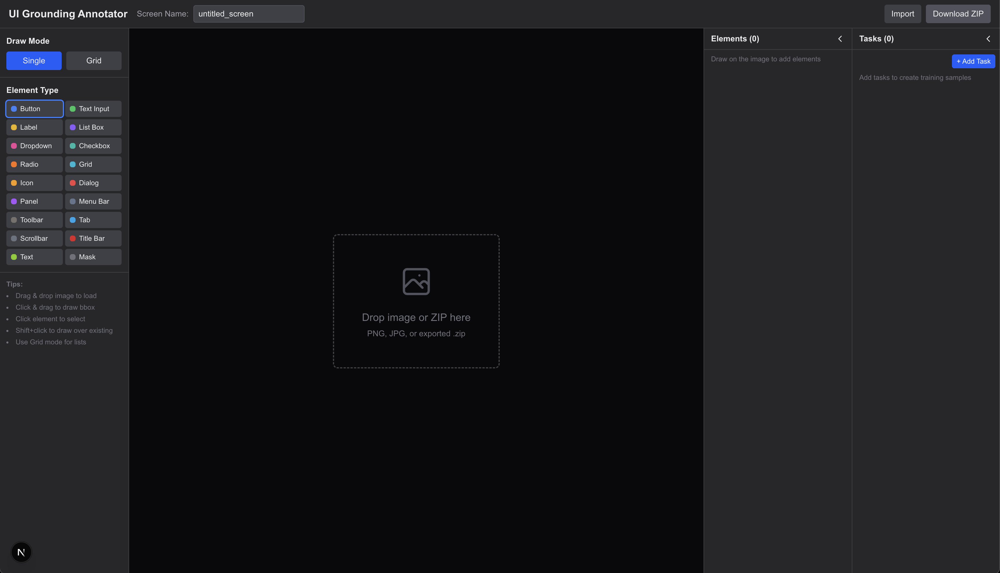
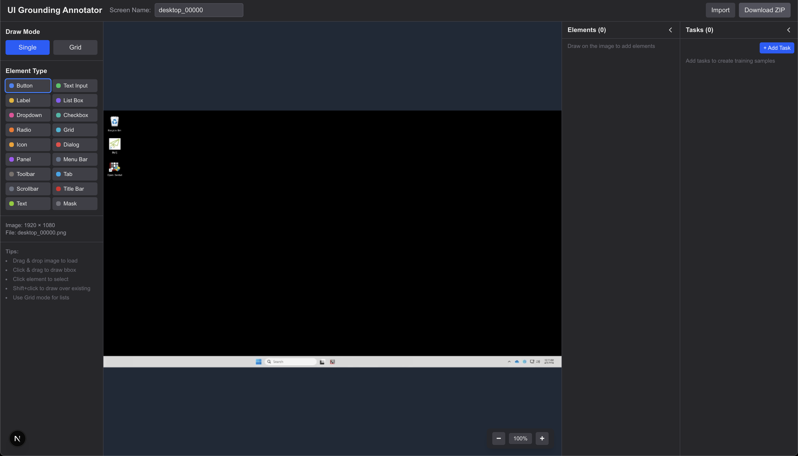
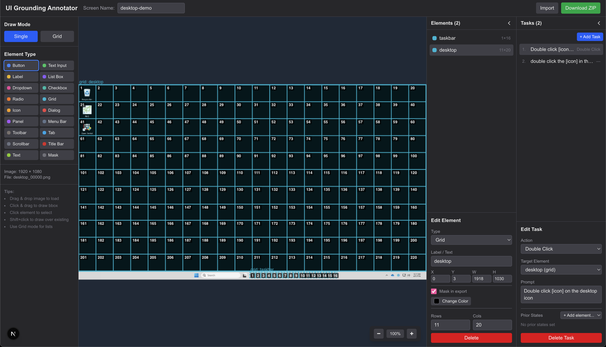
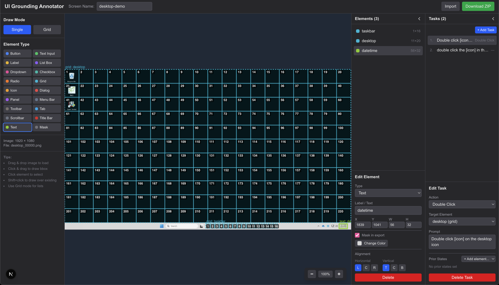
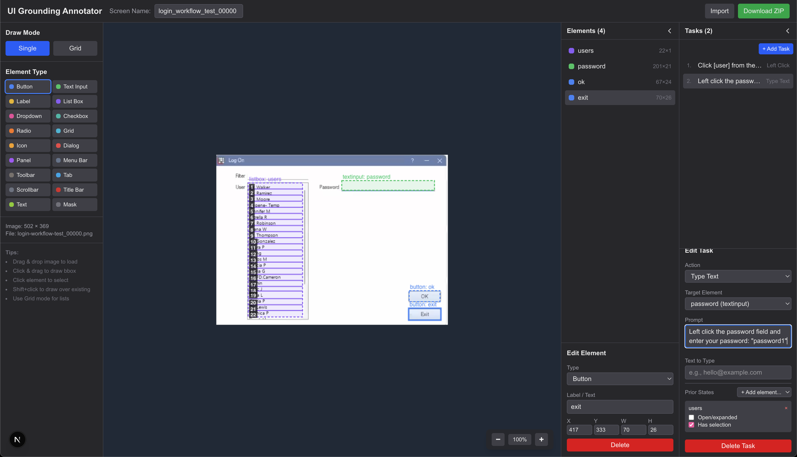
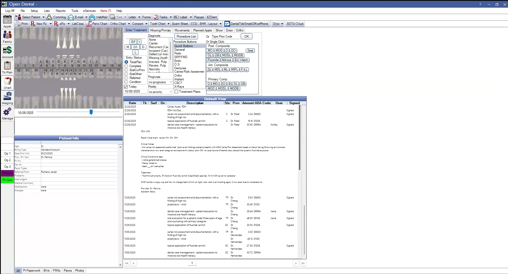
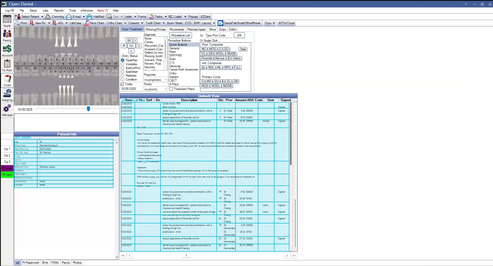
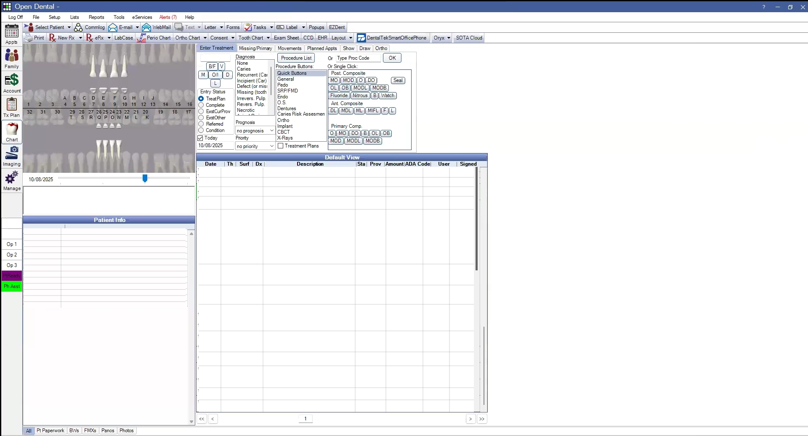

# Qwen3-VL Computer Use Annotator

A visual annotation tool for creating training data for Vision-Language Models (VLMs) to perform computer use tasks. Designed for fine-tuning models like Qwen3-VL for UI grounding and interaction.

## Screenshots

### Annotator Interface

**Empty State** - Drop zone for loading screenshots or previously exported ZIP files. Left sidebar shows element type palette and draw mode options (Single/Grid).



**Image Loaded** - Windows desktop screenshot loaded and ready for annotation. File info displays dimensions and filename. Tips panel shows keyboard shortcuts.



**Grid Annotation** - 11×20 grid drawn over the desktop to define icon slot positions. Each cell is numbered for reference. Grid dimensions are configurable in the Edit Element panel.



**Element Editing** - Multiple elements annotated (desktop grid, taskbar, datetime). The selected text element shows configuration options: label, coordinates, mask toggle, and text alignment controls.



**Task Editing with Prior States** - Login dialog with annotated elements (user listbox, password field, buttons). Task panel shows action type, target element, prompt text, and prior states configuration. Prior states define element conditions (open/expanded, has selection) for training data variation.



### Export Examples

The annotator exports a ZIP containing the original screenshot, an annotated version with bounding box overlays, and a masked version with dynamic content regions filled.

| Original | Annotated | Masked |
|----------|-----------|--------|
|  |  |  |

- **Original**: Source screenshot of Open Dental chart view
- **Annotated**: Bounding boxes overlaid showing element regions and labels
- **Masked**: Dynamic content (patient data table) masked with solid color for template generation

## Features

- **Element Annotation**: Draw bounding boxes for UI elements (buttons, text inputs, dropdowns, grids, icons, panels, etc.)
- **Task Definition**: Create tasks with prompts and target elements
- **Prior States**: Define element states (filled, selected, checked, open, visible) for training data variation
- **Grid Mode**: Quickly annotate grids, icon arrays, and list boxes
- **Masking**: Mask dynamic content regions for template generation
- **Color Sampling**: Sample background colors from the image for accurate masking
- **Icon Export**: Export icon grids as individual cropped images
- **Panel Visibility**: Control which panels are visible per task for loading screens/dialogs
- **Zoom/Pan**: Navigate large screenshots easily

## Element Types

- Button, Text Input, Label
- Dropdown, List Box, Checkbox, Radio
- Grid, Icon
- Panel, Dialog, Toolbar, Menu Bar, Tab
- Scrollbar, Title Bar
- Text (maskable text regions)

## Export Format

Exports a ZIP containing:
- `annotation.json` - Element definitions, tasks, and metadata
- `original.png` - Original screenshot
- `masked.png` - Screenshot with dynamic regions masked
- `annotated.png` - Screenshot with bounding box overlays
- `icons/` - Cropped icon images (when "Export to ZIP" is enabled)

## Getting Started

```bash
npm install
npm run dev
```

Open http://localhost:3000 and drag an image or ZIP to start annotating.

## Usage

1. **Load Image**: Drag & drop a screenshot or previously exported ZIP
2. **Select Element Type**: Choose the type of UI element to annotate
3. **Draw Bounding Boxes**: Click and drag on the image to create elements
4. **Configure Elements**: Set labels, mask colors, rows/cols for grids
5. **Create Tasks**: Define interaction tasks with prompts and target elements
6. **Set Prior States**: Configure element states and panel visibility per task
7. **Export**: Download ZIP with all annotation data and images

## Keyboard/Mouse

- Click & drag: Draw new element
- Shift + click & drag: Draw over existing elements
- Click element: Select
- Shift + click: Multi-select range (for bulk delete)
- Drag edges: Resize element

## Contributing

1. Fork the repository
2. Create a feature branch
3. Make your changes:
   - Generalize hardcoded values rather than replacing them with your own
   - Add tests for new functionality
   - Ensure all quality checks pass
4. Submit a pull request

**Code quality requirements:**
- Lexical complexity checks
- Syntax linting
- Code formatting
- Copyright headers

AI-assisted code is welcome provided it includes tests and passes all checks.

## License

Copyright (c) 2025 Tylt LLC. All rights reserved.

This software is source-available for **research and educational purposes only**.
Commercial use requires a separate license agreement with Tylt LLC (1% of annual
gross revenue attributable to use of this software).

See [LICENSE](./LICENSE) for full terms.

For commercial licensing inquiries: hello@claimhawk.app
